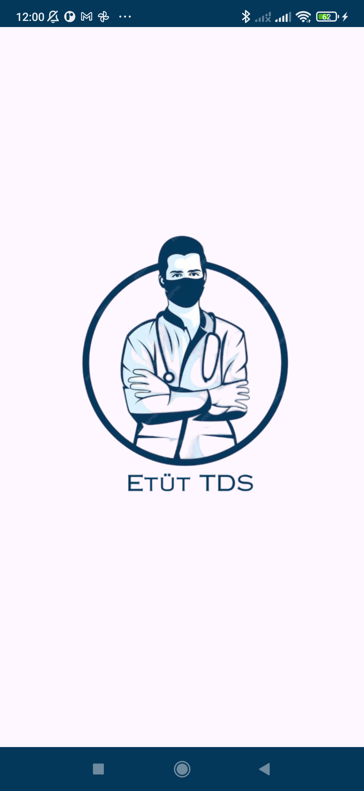
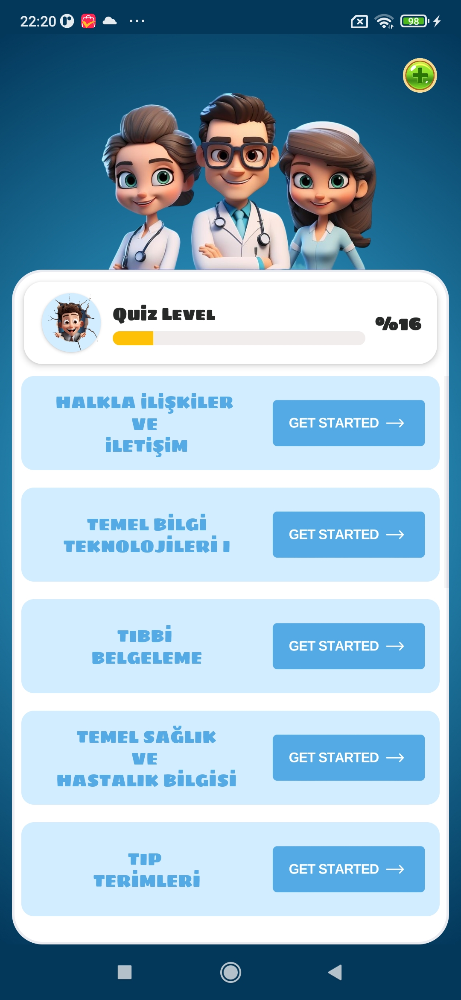
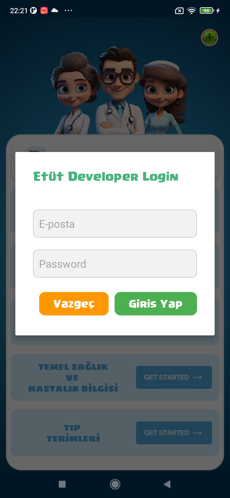
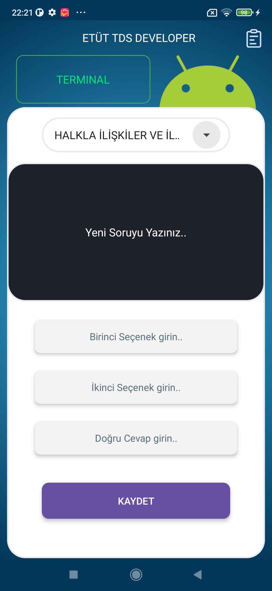
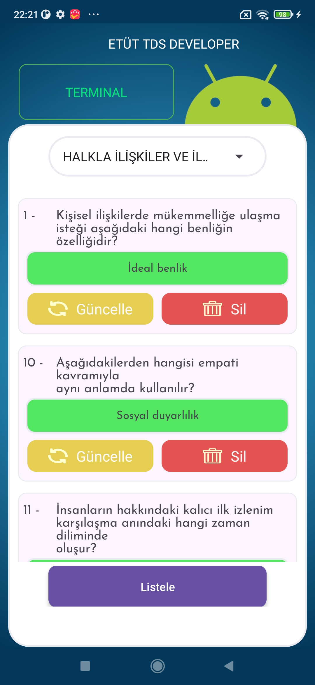
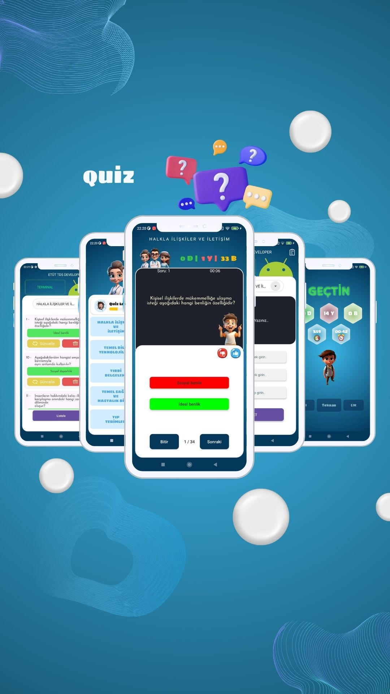

# Etüt-TDS
Etüt - Tıbbi Dokümantasyon ve Sekreterlik Quiz App

## 1- ILK KURULUM - Proje Oluşturma.

## 2- Logo - App logo ve açılış Sayfanın Hazırlanması.

## 3- AnaSayfa - Ders Listesinin Hazırlanması.

## 4- Quiz - Quiz/Test Arayüzünün Oluşturulması.

## 5- Quiz - Quiz Sonuc/Test Sonuç Arayüzünün Oluşturulması.

## 6- Developer - Geliştirici Arayüzünün Oluşturulması.

## 7- Developer Login - Geliştirici Arayüzüne Giriş Oluşturulması ve Bağlantının Sağlanması.

## 8- Developer FireStore - FireStoreye Soru Ekleme Bağlantıları Oluşturuldu.

## 9- TDS Quiz Yayın Testine Başlatıldı.

-> Test Apk Yayın Linki: [TDS Quiz App](https://play.google.com/apps/internaltest/4701420823027206860)